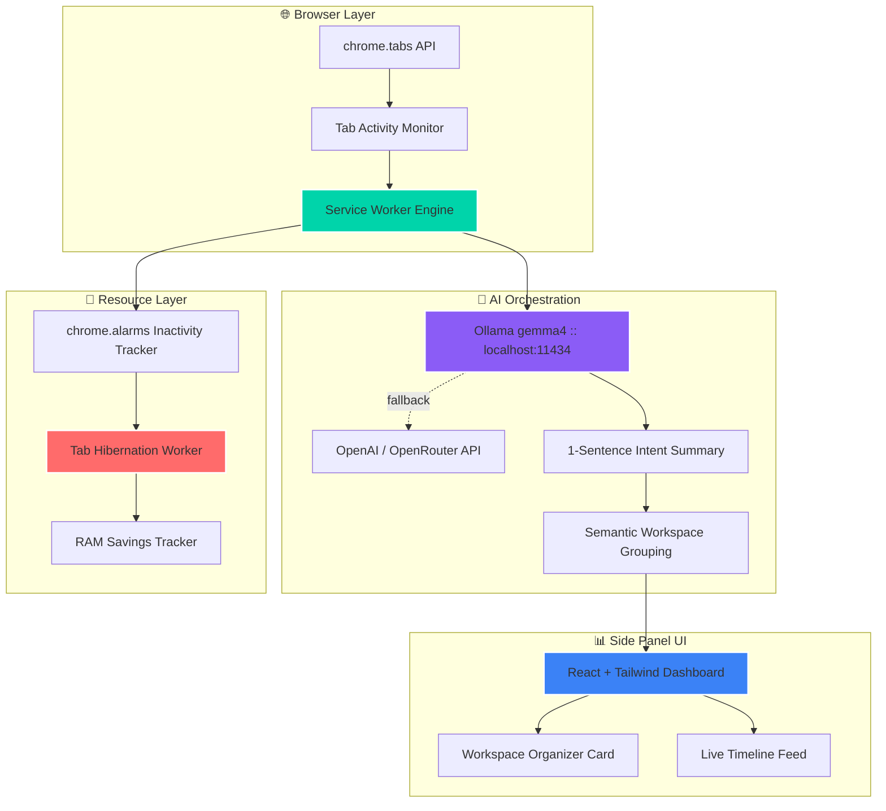

<div align="center">

# 🧠 ContextTab
### *Your Browser's Second Brain*
#### 🏆 **Elevate 2026 Hackathon Submission** 🏆


<p align="center">
  
  
  
  
  
</p>


</div>

---

<div align="center">

## 🎯 **Solving the Tab Overload Catch-22**


</div>

---

## 🌟 **Why ContextTab?**

<div align="center">

</div>

<table>
<tr>
<td width="50%" align="center">

### 🔥 **The Problem**

```yaml
Current Pain Points:
  - Tab Hoarding: "30-100 tabs kept open daily"
  - RAM Drain: "Gigabytes lost to idle tabs"
  - Cognitive Load: "Context = fear of losing it"
  - Dumb Grouping: "Chrome groups by URL, not intent"

Critical Stats:
  - Avg Open Tabs: "50+ per knowledge worker"
  - RAM per Tab: "~120MB wasted on idle pages"
  - Recall Cost: "Minutes lost re-finding context"
  - Privacy Risk: "Cloud tab-managers see your data"
```

</td>
<td width="50%" align="center">

### ✨ **Our Revolution**

```yaml
ContextTab Solutions:
  - Intent Engine: "AI summarizes WHY a tab is open"
  - Smart Grouping: "Clusters tabs by workflow, not domain"
  - Auto-Hibernation: "Sleeps idle tabs, wakes instantly"
  - Local-First: "Runs on-device via Ollama by default"

Performance Gains:
  - RAM Saved: "Up to 120MB reclaimed per tab"
  - Setup Cost: "₹0 — runs on local Ollama models"
  - Privacy: "No page content leaves the device"
  - Context Recall: "One click restores full workflow"
```

</td>
</tr>
</table>

---

<div align="center">

## 🏗️ **Architecture Overview**


</div>



---

<div align="center">

## 🚀 **Tech Stack**


</div>

<div align="center">

### **🖥️ Frontend Panel**


### **⚙️ Engine & Browser APIs**


### **🤖 AI Orchestration**


</div>

---

## 🎯 **Core Capabilities**

<table>
<tr>
<td width="33%" align="center">

### 🧭 **Workflow-Aware AI**

**What it does:**
- Generates 1-sentence **intent summaries** per tab
- Groups tabs by **semantic purpose**, not just domain
- Names workspaces like *"OAuth Configuration"* automatically

</td>
<td width="33%" align="center">

### 🔒 **Local-First Privacy**

**What it does:**
- Default inference via **local Ollama** (`gemma4`)
- API keys stored only in `chrome.storage.local`
- Only page **titles/domains** ever leave the device

</td>
<td width="33%" align="center">

### 🌙 **Adaptive Hibernation**

**What it does:**
- Auto-sleeps tabs after a configurable idle timeout
- Manual hibernate via the 🌙 icon
- Instant wake-and-restore on click

</td>
</tr>
</table>

---

<div align="center">

## 📊 **Performance Snapshot**


</div>

<table align="center">
<tr>
<th>Metric</th>
<th>Traditional Tab Management</th>
<th>ContextTab</th>
<th>Improvement</th>
</tr>
<tr>
<td><strong>Memory per Idle Tab</strong></td>
<td>Full page weight retained</td>
<td>Up to 120MB reclaimed</td>
<td>🚀 Significant RAM recovery</td>
</tr>
<tr>
<td><strong>Tab Grouping Logic</strong></td>
<td>Manual or URL-based</td>
<td>AI semantic intent clustering</td>
<td>🧠 Context-aware, not string-matched</td>
</tr>
<tr>
<td><strong>Data Privacy</strong></td>
<td>Often cloud-dependent</td>
<td>Local Ollama by default</td>
<td>🛡️ Local-first, serverless</td>
</tr>
<tr>
<td><strong>API Cost on Repeat Visits</strong></td>
<td>Re-queries every load</td>
<td>Cached by URL</td>
<td>💰 Avoids redundant LLM calls</td>
</tr>
</table>

---

## 🛠️ Setup & Installation

### Prerequisites
[Node.js](https://nodejs.org/) v18+ recommended.

### 1. Build the Extension
```bash
# Install all React, TypeScript, and Vite dependencies
npm install

# Compile into the Chrome extension package
npm run build
# (Windows fallback if env paths are isolated):
.\node_modules\.bin\vite.cmd build
```
This generates a production-ready **`dist`** folder containing `manifest.json`, `background.js`, and the compiled side-panel bundle.

### 2. Load into Google Chrome
1. Navigate to `chrome://extensions/`
2. Toggle **Developer mode** ON (top-right)
3. Click **Load unpacked**
4. Select the generated **`dist`** folder
5. Pin **ContextTab** from the extensions toolbar icon

---

## 🧪 Testing & Debugging

<table>
<tr><td>

1. **Start Ollama locally**
   ```bash
   ollama run gemma4
   ```
2. **Open the panel** — click the ContextTab toolbar icon to open the Chrome Side Panel.
3. **Configure provider** — Settings gear ⚙️ lets you switch between Ollama (default), OpenAI, or OpenRouter.
4. **Tab tracking test** — open new tabs and watch the live timeline feed update.
5. **AI summary check** — visit any page; ContextTab calls the model for a 1-sentence intent summary.
6. **Grouping test** — open 4–5 related tabs (e.g. AWS console, billing docs, GitHub issues) and click **Organize**.
7. **Hibernation test** — toggle "Auto Tab Hibernation" ON and adjust the idle timeout slider, or hibernate manually via 🌙.
8. **View logs** — right-click the icon → **Inspect Side Panel**, or open the **service worker** link under ContextTab in `chrome://extensions/`.

</td></tr>
</table>

---

## 📦 Packaging for Submission

1. `npm run build` to compile the latest source.
2. Zip the **`dist`** directory (e.g., `ContextTab_Submission.zip`).
3. Upload to the Chrome Web Store Developer Dashboard or attach to your Devpost submission.

---

<details>
<summary>🎤 <strong>5-Minute Demo Pitch Script (click to expand)</strong></summary>

**[0:00–0:30] Introduction**
> "Every knowledge worker knows this screen: 50 open tabs, a melting laptop, total cognitive overload. We keep tabs open because they represent unresolved thoughts — closing them means losing context. That's why we built ContextTab: Your Browser's Second Brain."

**[0:30–1:30] The Core Innovation**
> "Traditional tab managers just save lists. ContextTab understands workflows. Instead of asking 'what is this page about,' our AI asks 'what is the user trying to accomplish.'"

**[1:30–3:00] Live Walkthrough**
> "As I navigate Stack Overflow, GitHub, and the cloud console, ContextTab tracks each page and generates single-sentence intent summaries. Clicking 'Organize' groups them into labeled workspaces like 'AWS Deployment Workflow' and 'OAuth Configuration.'"

**[3:00–4:15] RAM Savings & Hibernation**
> "Our hibernation worker discards background tabs idle for 30+ minutes, prioritizing heavy pages like Figma or Sheets — saving up to 120MB per tab, tracked live on the dashboard. Clicking a hibernated tab restores it instantly."

**[4:15–5:00] Conclusion**
> "Everything runs locally inside Chrome's sandbox, so ContextTab protects privacy while reclaiming memory. We're turning browser chaos into organized intelligence. Thank you!"

</details>

<details>
<summary>💬 <strong>Q&A Preparation (click to expand)</strong></summary>

**Q1: How do you preserve privacy when sending data to AI?**
> ContextTab is serverless. API keys live only in `chrome.storage.local`. Only public page metadata (titles, domains) is sent for classification — never passwords, form entries, or cookies.

**Q2: Isn't Chrome's built-in tab grouping already doing this?**
> Chrome groups manually or by URL structure. ContextTab clusters by semantic intent — linking a design tab, a code tab, and a billing tab under one workspace task — and hibernates them dynamically.

**Q3: What happens if the API key gets rate-limited?**
> Summaries are cached by URL. Repeat or duplicate visits skip the LLM call entirely, conserving tokens and avoiding rate limits.

</details>

---

## 🚀 Roadmap

1. **Offline AI in-browser** — run quantized models (Llama 3 8B / Gemma 2B) via WebGPU, removing API key requirements entirely.
2. **Team Workspaces** — share session context via encrypted WebRTC for team-wide sync.
3. **Cross-Browser Sync** — extend timeline history securely to Firefox and Safari.

---

## 🔒 Privacy Policy Summary

ContextTab processes browsing details strictly inside the user's local extension environment. No analytics or page content is uploaded to secondary servers. Any data sent to a configured OpenAI/OpenRouter endpoint is governed by that provider's own privacy terms.

---

<div align="center">

## 🌟 Project Status


</div>
