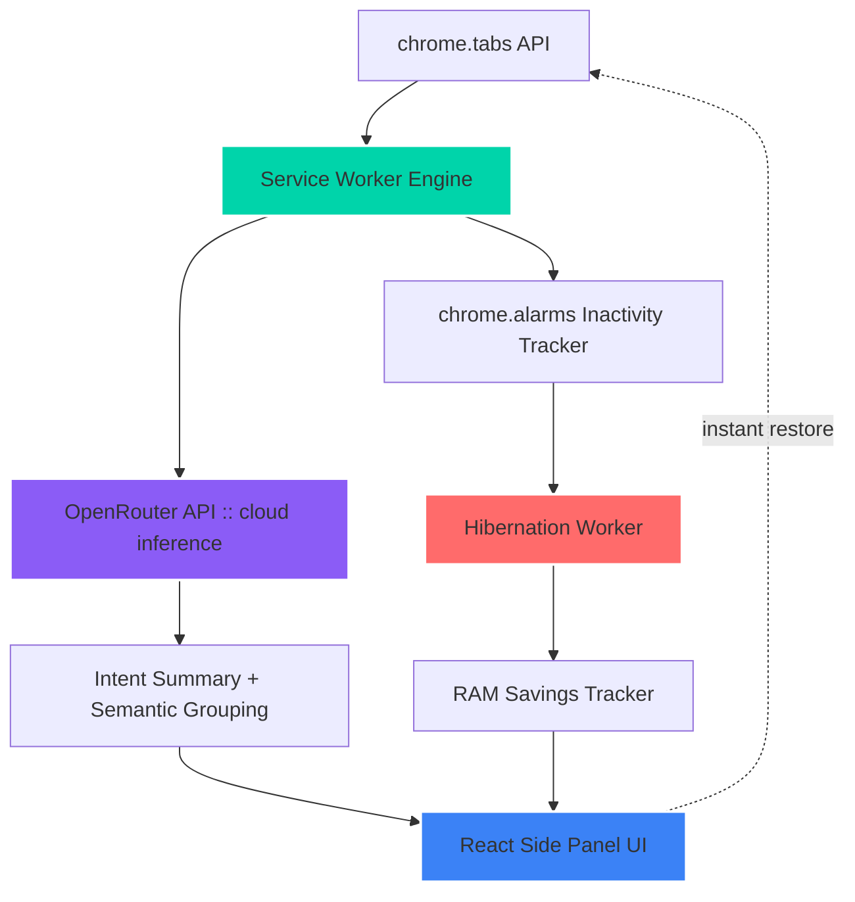

<div align="center">


<p align="center">
  
  
  
  
  
</p>
<p align="center">
  
</p>


</div>


<p align="center">
  
  
  
</p>


<div align="center">
<picture>
  <source media="(prefers-color-scheme: dark)" srcset="https://raw.githubusercontent.com/sushanth-kumar-prog/Loom/output/github-contribution-grid-snake-dark.svg">
  
</picture>
</div>


## Our Vision

> TabLoom is a smart Chrome extension designed to solve "tab hoarding." Instead of keeping dozens of tabs open out of fear of losing your thoughts, it uses AI to organize them by what you are actually doing, and puts unused tabs to sleep to speed up your computer.
<table>
<tr>
<td width="50%" align="center">

### Before TabLoom
```yaml
Open Tabs:        50-100
RAM Wasted:        ~120MB / idle tab
Grouping Logic:    manual / by URL
Context Recall:    "wait, why did I open this?"
Privacy:           cloud tab-managers see everything
```

</td>
<td width="50%" align="center">

### After TabLoom
```yaml
Open Tabs:         same, but organized
RAM Reclaimed:     up to 120MB / hibernated tab
Grouping Logic:    AI semantic intent clustering
Context Recall:    1-sentence summary, instantly
Privacy:           routed through OpenRouter, keys local
```

</td>
</tr>
</table>


## Live Architecture

<div align="center">

</div>

<div align="center">
<details>
<summary></summary>



</details>
</div>


## Tech Stack

<table align="center">
<tr>
<td width="33%" align="center">

**Frontend Panel**


<br/>


</td>
<td width="33%" align="center">

**Engine & Browser APIs**


<br/>


</td>
<td width="33%" align="center">

**AI Orchestration**


<br/>


</td>
</tr>
</table>


## Core Capabilities

<table>
<tr>
<td width="33%" valign="top">

### Workflow-Aware AI
* 1-sentence **intent summary** per tab
* Groups by **semantic purpose**, not domain
* Auto-names workspaces, e.g. *"OAuth Configuration"*

</td>
<td width="33%" valign="top">

### Cloud-Powered Privacy
* Inference routed through **OpenRouter**
* Keys stored only in `chrome.storage.local`
* Only page **titles/domains** ever leave the device

</td>
<td width="33%" valign="top">

### Adaptive Hibernation
* Auto-sleeps idle tabs after a set timeout
* One-click manual hibernate
* Instant wake-and-restore, zero lag

</td>
</tr>
</table>


## Comparison

<table align="center">
<tr>
<th>Metric</th>
<th>Traditional Tab Management</th>
<th>TabLoom</th>
<th>Result</th>
</tr>
<tr>
<td><strong>Memory per Idle Tab</strong></td>
<td>Full page weight retained</td>
<td>Up to 120MB reclaimed</td>
<td>Real RAM recovery</td>
</tr>
<tr>
<td><strong>Tab Grouping Logic</strong></td>
<td>Manual or URL-based</td>
<td>AI semantic intent clustering</td>
<td>Context-aware, not string-matched</td>
</tr>
<tr>
<td><strong>Data Privacy</strong></td>
<td>Often opaque, mixed providers</td>
<td>Routed through OpenRouter, keys stay local</td>
<td>Transparent, single-provider routing</td>
</tr>
<tr>
<td><strong>Repeat-Visit API Cost</strong></td>
<td>Re-queries every load</td>
<td>Cached by URL</td>
<td>No redundant LLM calls</td>
</tr>
</table>


## Setup & Installation

**Prerequisites:** [Node.js](https://nodejs.org/) v18+

```bash
# 1. Install dependencies
npm install

# 2. Compile into the Chrome extension package
npm run build
# Windows fallback if env paths are isolated:
# .\node_modules\.bin\vite.cmd build
```

This produces a production-ready **`dist/`** folder with `manifest.json`, `background.js`, and the compiled side-panel bundle.

**Load it into Chrome:**
1. Go to `chrome://extensions/`
2. Toggle **Developer mode** ON
3. Click **Load unpacked** → select **`dist`**
4. Pin **TabLoom** from the toolbar


## Testing & Debugging

| Step | Action |
|---|---|
| 1 | Add your **OpenRouter API key** in Settings to start inference |
| 2 | Click the toolbar icon to open the Side Panel |
| 3 | Settings → confirm the active OpenRouter model |
| 4 | Open tabs → watch the live timeline feed update |
| 5 | Visit any page → AI generates a 1-sentence intent summary |
| 6 | Open 4 to 5 related tabs → click **Organize** to auto-cluster |
| 7 | Toggle **Auto Hibernation** ON, or hibernate manually |
| 8 | Right-click icon → **Inspect Side Panel**, or open the **service worker** link in `chrome://extensions/` for logs |


<details>
<summary><sub>Snake graphic not animating yet?</sub></summary>

This repo's `.github/workflows/snake.yml` auto-generates it from this account's contribution history.
1. **Settings → Actions → General** → set Workflow permissions to **Read and write**
2. **Actions** tab → run the **generate-snake** workflow once
3. It publishes to an auto-created `output` branch, then goes live above automatically. No further upkeep needed.

</details>


<details>
<summary><strong>Q&A Preparation (click to expand)</strong></summary>

**Q1: How do you preserve privacy when sending data to AI?**
> TabLoom is serverless. API keys live only in `chrome.storage.local`. Only public page metadata (titles, domains) is sent to OpenRouter for classification, never passwords, form entries, or cookies.

**Q2: Isn't Chrome's built-in tab grouping already doing this?**
> Chrome groups manually or by URL structure. TabLoom clusters by semantic intent, linking a design tab, a code tab, and a billing tab under one workspace task, and hibernates them dynamically.

**Q3: What happens if the API key gets rate-limited?**
> Summaries are cached by URL. Repeat or duplicate visits skip the LLM call entirely, conserving tokens and avoiding rate limits.

</details>


## Roadmap

1. **Offline AI in-browser:** quantized Llama 3 8B / Gemma 2B via WebGPU, zero API keys
2. **Team Workspaces:** encrypted WebRTC session sharing for team-wide context sync
3. **Cross-Browser Sync:** extend timeline history securely to Firefox and Safari

## Privacy Policy Summary

TabLoom processes browsing details strictly inside the local extension environment. No analytics or page content is uploaded to secondary servers beyond the configured OpenRouter endpoint, which is governed by OpenRouter's own terms.


<div align="center">


<sub><strong>Event:</strong> Elevate 2026 &nbsp;|&nbsp; <strong>Organizer:</strong> Ideakode &nbsp;|&nbsp; <strong>Team:</strong> sushramesh5</sub>
<br/>
<sub> Repo: sushanth-kumar-prog/Loom</sub>

</div>
