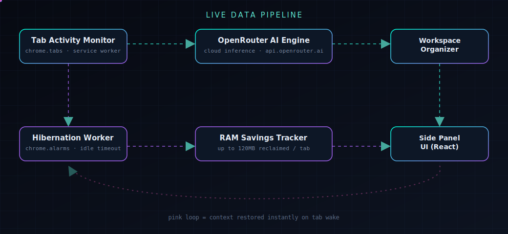
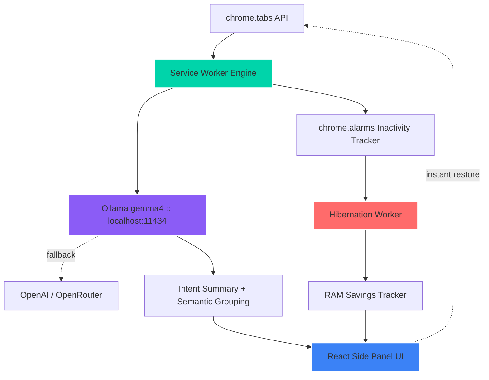

<div align="center">




<p align="center">
  
  
  
  
  
</p>
<p align="center">
  
</p>


</div>


## 🎯 The Pitch in One Breath

> Knowledge workers don't hoard tabs out of laziness — they hoard them because **closing a tab feels like losing a thought**. ContextTab is a Manifest V3 Chrome extension that watches your tabs, asks a local LLM *"what is this person actually trying to do?"*, clusters tabs into named workspaces by **intent** instead of domain, and puts idle tabs to sleep — reclaiming RAM without ever touching the cloud.

<table>
<tr>
<td width="50%" align="center">

### 🔥 Before ContextTab
```yaml
Open Tabs:        50-100
RAM Wasted:        ~120MB / idle tab
Grouping Logic:    manual / by URL
Context Recall:    "wait, why did I open this?"
Privacy:           cloud tab-managers see everything
```

</td>
<td width="50%" align="center">

### ✨ After ContextTab
```yaml
Open Tabs:         same, but organized
RAM Reclaimed:     up to 120MB / hibernated tab
Grouping Logic:    AI semantic intent clustering
Context Recall:    1-sentence summary, instantly
Privacy:           100% local Ollama by default
```

</td>
</tr>
</table>


## 🏗️ Live Architecture

<div align="center">

</div>

<details>
<summary>📐 <strong>Prefer a static technical diagram? Click to expand the Mermaid version</strong></summary>



</details>


## 🚀 Tech Stack

<div align="center">

**Frontend Panel**
<br/>


**Engine & Browser APIs**
<br/>


**AI Orchestration**
<br/>


</div>


## 🎯 Core Capabilities

<table>
<tr>
<td width="33%" valign="top">

### 🧭 Workflow-Aware AI
- 1-sentence **intent summary** per tab
- Groups by **semantic purpose**, not domain
- Auto-names workspaces, e.g. *"OAuth Configuration"*

</td>
<td width="33%" valign="top">

### 🔒 Local-First Privacy
- Default inference via **local Ollama** (`gemma4`)
- Keys stored only in `chrome.storage.local`
- Only page **titles/domains** ever leave the device

</td>
<td width="33%" valign="top">

### 🌙 Adaptive Hibernation
- Auto-sleeps idle tabs after a set timeout
- One-click manual hibernate via 🌙
- Instant wake-and-restore, zero lag

</td>
</tr>
</table>


## 📊 Performance Snapshot

<table align="center">
<tr>
<th>Metric</th>
<th>Traditional Tab Management</th>
<th>ContextTab</th>
<th>Result</th>
</tr>
<tr>
<td><strong>Memory per Idle Tab</strong></td>
<td>Full page weight retained</td>
<td>Up to 120MB reclaimed</td>
<td>🚀 Real RAM recovery</td>
</tr>
<tr>
<td><strong>Tab Grouping Logic</strong></td>
<td>Manual or URL-based</td>
<td>AI semantic intent clustering</td>
<td>🧠 Context-aware, not string-matched</td>
</tr>
<tr>
<td><strong>Data Privacy</strong></td>
<td>Often cloud-dependent</td>
<td>Local Ollama by default</td>
<td>🛡️ Local-first, serverless</td>
</tr>
<tr>
<td><strong>Repeat-Visit API Cost</strong></td>
<td>Re-queries every load</td>
<td>Cached by URL</td>
<td>💰 No redundant LLM calls</td>
</tr>
</table>


## 🛠️ Setup & Installation

**Prerequisites:** [Node.js](https://nodejs.org/) v18+

```bash
# 1. Install dependencies
npm install

# 2. Compile into the Chrome extension package
npm run build
# Windows fallback if env paths are isolated:
# .\node_modules\.bin\vite.cmd build
```

This produces a production-ready **`dist/`** folder with `manifest.json`, `background.js`, and the compiled side-panel bundle.

**Load it into Chrome:**
1. Go to `chrome://extensions/`
2. Toggle **Developer mode** ON
3. Click **Load unpacked** → select **`dist`**
4. Pin **ContextTab** from the toolbar


## 🧪 Testing & Debugging

| Step | Action |
|---|---|
| 1 | `ollama run gemma4` to start local inference |
| 2 | Click the toolbar icon to open the Side Panel |
| 3 | Settings ⚙️ → switch between Ollama / OpenAI / OpenRouter |
| 4 | Open tabs → watch the live timeline feed update |
| 5 | Visit any page → AI generates a 1-sentence intent summary |
| 6 | Open 4–5 related tabs → click **Organize** to auto-cluster |
| 7 | Toggle **Auto Hibernation** ON, or hibernate manually via 🌙 |
| 8 | Right-click icon → **Inspect Side Panel**, or open the **service worker** link in `chrome://extensions/` for logs |


## 🐍 Live Contribution Snake

This repo ships with a ready-to-use GitHub Actions workflow (`.github/workflows/snake.yml`) that renders the maintainer's contribution graph as an animated snake, updated daily.

**To activate it:**
1. Push this repo to GitHub with the included `.github/workflows/snake.yml`
2. In **Settings → Actions → General**, set Workflow permissions to **Read and write**
3. Run the workflow once from the **Actions** tab (or wait for the next push/cron tick)
4. It publishes the SVGs to an auto-created `output` branch — then embed it:

```md
<picture>
  <source media="(prefers-color-scheme: dark)" srcset="https://raw.githubusercontent.com/YOUR_USERNAME/ContextTab/output/github-contribution-grid-snake-dark.svg">
  
</picture>
```

<div align="center">
<picture>
  <source media="(prefers-color-scheme: dark)" srcset="https://raw.githubusercontent.com/YOUR_USERNAME/ContextTab/output/github-contribution-grid-snake-dark.svg">
  
</picture>
</div>

> Until the workflow has run at least once, the image above will 404 — that's expected for a brand-new repo. The moment Actions runs, it goes live and starts animating automatically, no further upkeep needed.


<details>
<summary>🎤 <strong>5-Minute Demo Pitch Script (click to expand)</strong></summary>

**[0:00–0:30] Introduction**
> "Every knowledge worker knows this screen: 50 open tabs, a melting laptop, total cognitive overload. We keep tabs open because they represent unresolved thoughts — closing them means losing context. That's why we built ContextTab: Your Browser's Second Brain."

**[0:30–1:30] The Core Innovation**
> "Traditional tab managers just save lists. ContextTab understands workflows. Instead of asking 'what is this page about,' our AI asks 'what is the user trying to accomplish.'"

**[1:30–3:00] Live Walkthrough**
> "As I navigate Stack Overflow, GitHub, and the cloud console, ContextTab tracks each page and generates single-sentence intent summaries. Clicking 'Organize' groups them into labeled workspaces like 'AWS Deployment Workflow' and 'OAuth Configuration.'"

**[3:00–4:15] RAM Savings & Hibernation**
> "Our hibernation worker discards background tabs idle for 30+ minutes, prioritizing heavy pages like Figma or Sheets — saving up to 120MB per tab, tracked live on the dashboard. Clicking a hibernated tab restores it instantly."

**[4:15–5:00] Conclusion**
> "Everything runs locally inside Chrome's sandbox, so ContextTab protects privacy while reclaiming memory. We're turning browser chaos into organized intelligence. Thank you!"

</details>

<details>
<summary>💬 <strong>Q&A Preparation (click to expand)</strong></summary>

**Q1: How do you preserve privacy when sending data to AI?**
> ContextTab is serverless. API keys live only in `chrome.storage.local`. Only public page metadata (titles, domains) is sent for classification — never passwords, form entries, or cookies.

**Q2: Isn't Chrome's built-in tab grouping already doing this?**
> Chrome groups manually or by URL structure. ContextTab clusters by semantic intent — linking a design tab, a code tab, and a billing tab under one workspace task — and hibernates them dynamically.

**Q3: What happens if the API key gets rate-limited?**
> Summaries are cached by URL. Repeat or duplicate visits skip the LLM call entirely, conserving tokens and avoiding rate limits.

</details>


## 🚀 Roadmap

1. **Offline AI in-browser** — quantized Llama 3 8B / Gemma 2B via WebGPU, zero API keys
2. **Team Workspaces** — encrypted WebRTC session sharing for team-wide context sync
3. **Cross-Browser Sync** — extend timeline history securely to Firefox and Safari

## 🔒 Privacy Policy Summary

ContextTab processes browsing details strictly inside the local extension environment. No analytics or page content is uploaded to secondary servers. Any data sent to a configured OpenAI/OpenRouter endpoint is governed by that provider's own terms.


<div align="center">


<sub>Made with 🧠 + ☕ for Elevate 2026 — replace <code>YOUR_USERNAME</code> throughout this README before pushing.</sub>

</div>
